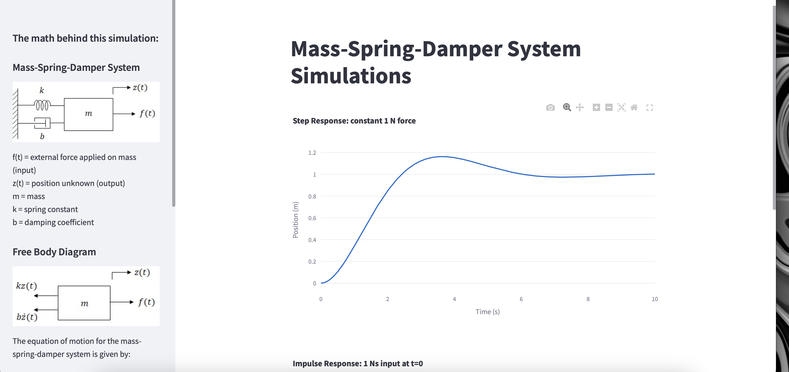

# Mass Spring Damper Simulation

This repository contains a Python simulation for a Mass-Spring-Damper system, originally inspired by MatLab simulations popular at Ohio State University during my Control System Engineering studies. The simulation solves the system's equations of motion and plots the system's response to both impulse and steady-state inputs.

## Background
The simulation is based on the transfer function obtained from the Laplace transform of the system's differential equation. This approach assumes the system is linear and time-invariant. While most physical systems exhibit non-linear behaviors like varying friction, the simulation provides accurate results within typical operating conditions. These simplifications make transfer function analysis a valuable tool for preliminary system behavior predictions.

## Transfer Function Assumptions
- **Linearity**: The system must be linear, meaning its response at any instant depends only on its current state, not its history.
- **Time Invariance**: The system's characteristics do not change over time.

Understanding the foundational assumptions of the Laplace transform is crucial for applying it correctly in practical scenarios.